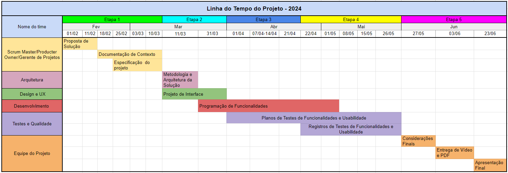
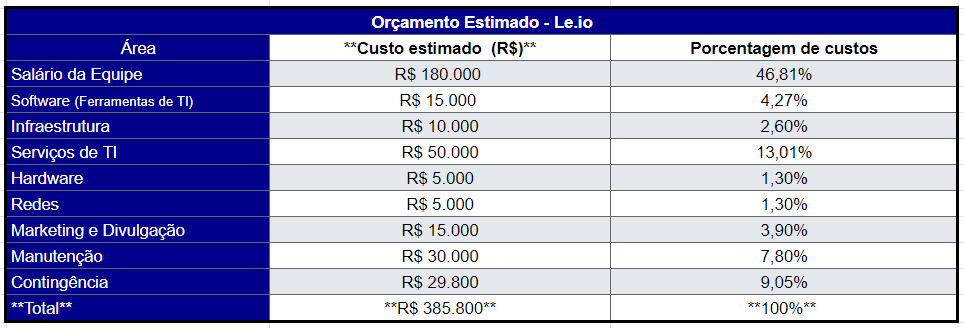

# Especificações do Projeto

## Personas

- Identificamos personas representativas para compreender suas necessidades e expectativas. 

- Cada persona reflete uma experiência única relacionada à leitura.

- Exploraremos as histórias e motivações de cada persona, destacando desafios e objetivos. Buscamos criar uma plataforma inclusiva e envolvente para amantes da literatura.

| **Persona** | **Ilustração** | **Descrição** | **Interesses** | **Desafios** | **Objetivo Principal** |
|-------------|-------------|-------------|-------------|-------------|------------------------|
| **Maria**, 32 anos |   | Professora universitária apaixonada por literatura | Literatura, organização, acompanhamento de progresso | Encontrar uma maneira eficiente de catalogar e acompanhar suas leituras | Manter um registro organizado de suas leituras para acompanhar seu progresso e descobrir novos livros interessantes |
| **Lucas**, 21 anos |    | Estudante universitário de engenharia | Acadêmicos, aprendizado, conveniência | Encontrar materiais de estudo relevantes e acessíveis | Ter acesso fácil a livros e materiais de estudo relevantes para seus cursos e pesquisas acadêmicas |
| **André**, 25 anos |   | Jovem em busca de novas leituras | Diversidade de gêneros literários, exploração, expansão de conhecimento | Encontrar recomendações personalizadas | Encontrar livros que se adequem aos seus interesses e expandir seu conhecimento e experiência de leitura |
| **Rafaela**, 28 anos |   | Escritora iniciante interessada em descobrir novos autores e obras | Escrita, inspiração, exploração literária | Encontrar novos livros e autores que correspondam aos seus interesses | Explorar novos livros e autores que possam inspirar sua própria escrita e expandir seus horizontes literários |
| **Daniel**, 35 anos |  | Médico ocupado que deseja ler offline | Leitura, praticidade, flexibilidade | Baixar livros para leitura offline | Desfrutar da leitura mesmo sem conexão com a internet baixando livros |

## Histórias de Usuários

Com base na análise das personas identificamos as seguintes histórias de usuários:

|EU COMO... `PERSONA`| QUERO/PRECISO ... `FUNCIONALIDADE` |PARA ... `MOTIVO/VALOR`                 |
|--------------------|------------------------------------|----------------------------------------|
| Leitor ávido | Ter a capacidade de criar uma estante virtual para catalogar meus livros | Manter um registro organizado das minhas leituras e acompanhar meu progresso.  |
| Estudante universitário	| Acesso a livros acadêmicos e materiais de estudo relevantes para os meus cursos | Complementar meu aprendizado e realizar pesquisas acadêmicas de forma conveniente. |
| Usuário em busca de novas leituras | Navegar por uma variedade de gêneros literários	| Encontrar livros que se adequem aos meus interesses e expandir meu conhecimento e experiência de leitura. |
|Usuário interessado em descobrir novos autores e obras | Receber recomendações personalizadas com base nas minhas preferências de leitura e histórico de leitura | Explorar novos livros e autores que possam me interessar. |
| Usuário ocupado | Baixar livros para ler offline | Desfrutar da leitura mesmo quando estiver sem conexão com a internet. |

## Modelagem do Processo de Negócio 

### Análise da Situação Atual

Segundo Lucena, 2023, realizou uma pesquisa, a qual constata que a porcentagem de leitores no país caiu 4% e também numa outra pesquisa da Folha de São Paulo que revela o percentual  de lares com internet crescendo significativamente, foi pensado o aplicativo Le.io, cuja proposta é proporcionar ao leitor uma ferramenta que o auxilie. 
Atualmente, no mercado, existem aplicativos como o Kindle, Goodreads e Skoob. O Le.io, em comparação ao Goodreads, permite aos usuários catalogar os livros que já leram, estão lendo ou desejam ler, além de compartilhar resenhas, avaliações e recomendações de livros com amigos e a comunidade. O Le.io oferece a opção de adicionar à lista de troca, e-books para download, porém, diferente do Kindle, estes não são gratuitos. Além disso, o Le.io permite excluir livros e ouvir a prévia de um livro escolhido, promovendo o acesso à informação para pessoas com deficiência visual. As diferenças entre Le.io e Goodreads são as mesmas aplicadas ao Skoob. Acreditamos que, com os diferenciais em relação aos outros aplicativos citados e a inteligência artificial que possibilitará a leitura da tela, o potencial do Le.io é promissor para democratizar o acesso à leitura.

### Descrição Geral da Proposta

O aplicativo Le.io visa proporcionar aos leitores uma ferramenta de organização e compartilhamento de leituras pela internet, para assim, promover o incentivo à leitura e possibilitar um crescimento no número de leitores. Seu público-alvo são jovens e adultos, incluindo estudantes, professores, pesquisadores e profissionais da comunicação e acadêmicos, sem restrição de idade, classe social ou poder aquisitivo. Comparado a aplicativos como Kindle, Goodreads e Skoob, o Le.io oferece recursos como adicionar à lista de troca, e-books para download (não gratuitos), exclusão de livros e audição de prévias, especialmente úteis para pessoas com deficiência visual. A proposta é utilizar inteligência artificial para tornar a leitura mais acessível. As oportunidades de mercado incluem a expansão da base de usuários ao atender a demanda por aplicativos que promovam a leitura de forma inclusiva, mas enfrenta ameaças da concorrência e mudanças no mercado. Os objetivos do projeto incluem a organização da leitura pessoal, exploração de informações mais detalhadas sobre os livros e interação com outros leitores.

### Processo 1 – NOME DO PROCESSO

Apresente aqui o nome e as oportunidades de melhorias para o processo 1. Em seguida, apresente o modelo do processo 1, descrito no padrão BPMN. 

### Processo 2 – NOME DO PROCESSO

Apresente aqui o nome e as oportunidades de melhorias para o processo 2. Em seguida, apresente o modelo do processo 2, descrito no padrão BPMN.

## Indicadores de Desempenho

| **Indicador** | **Objetivos** | **Descrição** | **Cálculo** | **Fonte Dados** | **Perspectiva** |
|-------------|-------------|-------------|-------------|-------------|------------------------|
| Taxa de satisfação| Avaliar a satisfação dos usuários em relação à experiência com a aplicação. | Medir a aceitação da aplicação através da avaliação média atribuída pelos usuários. | Nota média da loja de aplicativo| Loja de Aplicativo| Aprimorar a qualidade|
| Número de downloads diário | Obter o número diário de downloads da aplicação. | Avaliar o número de downloads diários | Número de downloads | Loja de Aplicativo | Necessidade de aplicação|
| Reclamações recebidas | Minimizar a incidência de feedbacks negativos mensais. | Analisar a quantidade de reclamações recebidas | Somatório das reclamações por mês | Central de reclamações | Qualidade do produto |
| Cadastros Realizados | Analisar a quantidade de cadastros na plataforma | Total de cadastros em relação a plataforma | Crescimento mensal | Contador na plataforma | Aquisição de Novos Usuários e Expansão de Público. |
| Taxa de Utilização de Recursos de Acessibilidade | Medir a aceitação e uso dos recursos de acessibilidade, especialmente por usuários com deficiência visual. | Monitorar a utilização de funcionalidades como a leitura de livros em voz alta. | Número de usuários que utilizaram recursos de acessibilidade | Atividades do usuário no aplicativo. | Acessibilidade |
| Taxa de Atualização de Lista de Leitura | Verificar a frequência com que os usuários atualizam suas listas de leitura. | Acompanhar a modificação de status dos livros na lista do "Quero Ler" para "Lendo" ou "Lido". | Número de atualizações da lista de leitura | Atividades do usuário no aplicativo. | Engajamento do usuário. |

## Requisitos

As tabelas que se seguem apresentam os requisitos funcionais e não funcionais que detalham o escopo do projeto. Para determinar a prioridade de requisitos, aplicar uma técnica de priorização de requisitos e detalhar como a técnica foi aplicada.

### Requisitos Funcionais

|ID    | Descrição do Requisito  | Prioridade |
|------|-----------------------------------------|----|
|RF-01| O sistema deve permitir que o usuário crie, edite, visualize e exclua sua conta. | ALTA | 
|RF-02| O sistema deve permitir que o usuário possa buscar pelos seus livros pelo nome do livro ou autor.   | ALTA |
|RF-03| O sistema deve permitir que o usuário possa marcar seus livros de acordo com categorias pré estabelecidas, sendo elas: lido, lendo, relendo, quero ler, abandonei, tenho, desejado, favorito, emprestado e disponível para troca. | ALTA |
|RF-04| O sistema deve permitir que o usuário possa ler a descrição do livro buscado, contendo título, autor, imagem, editora, gênero, sinopse e avaliações. | ALTA |
|RF-05| O sistema deve permitir que o usuário baixe e-books para leitura de livros categorizados como domínio público. | ALTA |
|RF-06| O sistema deve permitir que o usuário possa ler uma prévia do livro ou ouvir esta prévia em formato de áudio. | MÉDIA |
|RF-07| O sistema deve permitir que o usuário possa avaliar o livro lido entre 1 e 5 estrelas. | MÉDIA |

### Requisitos não Funcionais

| ID   | Descrição                                                         | Prioridade |
|------|-------------------------------------------------------------------|------------|
| RNF-01 | O aplicativo deve garantir segurança na autenticação e na proteção dos dados do usuário. | ALTA       |
| RNF-02 | O aplicativo deve estar em conformidade com as leis e regulamentos de proteção de dados, como GDPR e LGPD. | ALTA       |
| RNF-03 | O aplicativo deve ter tempos de resposta rápidos, garantindo uma experiência fluida ao usuário. | ALTA       |
| RNF-04 | O aplicativo deve ter uma interface intuitiva e amigável, visando proporcionar uma experiência de uso agradável. | ALTA       |
| RNF-05 | O aplicativo deve ser compatível com os diferentes dispositivos móveis e suas versões de sistema operacional. | MÉDIA       |
| RNF-06 | O aplicativo deve seguir padrões de acessibilidade para garantir que todos os usuários possam utilizá-lo, independentemente de suas necessidades especiais. | MÉDIA      |

## Restrições

O projeto está restrito pelos itens apresentados na tabela a seguir.

|ID| Restrição                                             |
|--|-------------------------------------------------------|
|RE-01| O projeto deverá ser entregue no final do semestre letivo, não podendo extrapolar a data de 23/06/2024. |
|RE-02| A equipe não pode subcontratar o desenvolvimento do trabalho. |
|RE-03| O projeto não deve usar sistemas de IAs para o desenvolvimento do código. |
|RE-04| O projeto deve utilizar a linguagem de programação mobile React Native. |
|RE-05| O projeto deve utilizar uma conexão com banco de dados. |

## Diagrama de Casos de Uso

# Matriz de Rastreabilidade

# Gerenciamento de Projeto

De acordo com o PMBoK v6 as dez áreas que constituem os pilares para gerenciar projetos, e que caracterizam a multidisciplinaridade envolvida, são: Integração, Escopo, Cronograma (Tempo), Custos, Qualidade, Recursos, Comunicações, Riscos, Aquisições, Partes Interessadas. Para desenvolver projetos um profissional deve se preocupar em gerenciar todas essas dez áreas. Elas se complementam e se relacionam, de tal forma que não se deve apenas examinar uma área de forma estanque. É preciso considerar, por exemplo, que as áreas de Escopo, Cronograma e Custos estão muito relacionadas. Assim, se eu amplio o escopo de um projeto eu posso afetar seu cronograma e seus custos.

## Gerenciamento de Tempo

O gráfico de Gantt ou diagrama de Gantt também é uma ferramenta visual utilizada para controlar e gerenciar o cronograma de atividades de um projeto. Com ele, é possível listar tudo que precisa ser feito para colocar o projeto em prática, dividir em atividades e estimar o tempo necessário para executá-las.

## Gerenciamento de Equipe

A gestão da equipe requer a organização de seis equipes, cada uma dedicada a diferentes etapas do projeto. Cada equipe é composta pelos seis membros do projeto, que alternam suas responsabilidades ao longo do tempo. 

A tabela abaixo apresenta o gerenciamento da equipe:

## Gestão de Orçamento

A gestão do orçamento do projeto foi planejada considerando quatro eixos principais: 
alocação estratégica de recursos humanos em diversas equipes, aquisição de ferramentas fundamentais, utilização de serviços especializados e custos adicionais. 
Cada aspecto do orçamento foi otimizado para garantir uma distribuição eficiente dos recursos, assegurando o sucesso do projeto dentro das limitações financeiras estabelecidas.

A tabela abaixo apresenta o gerenciamento de orçamento:

