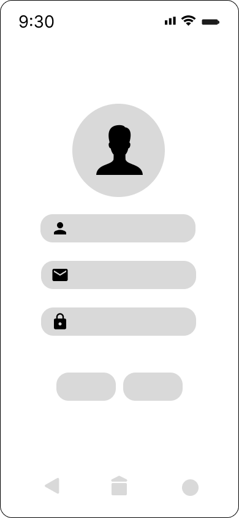
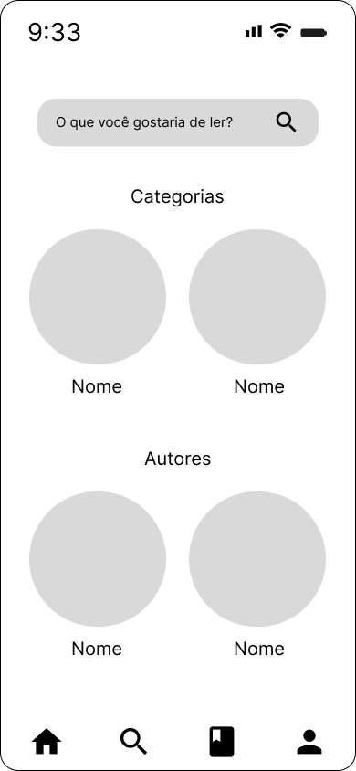
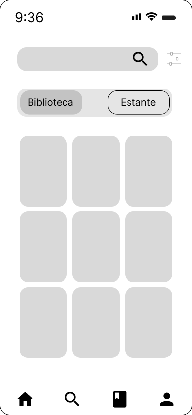

# Projeto de Interface

Pré-requisitos: <a href="02-Especificação do Projeto.md"> Documentação de Especificação</a>

Abaixo temos uma visão geral de como será o fluxo de interação do usuário com o aplicativo através do diagrama de fluxo e também apresentamos como será a estrutura do aplicativo através dos wireframes.

Todo o fluxo dentro do aplicativo e seus wireframes foram pensados para atender as necessidades do usuário.

## Diagrama de Fluxo

O diagrama apresenta o estudo do fluxo de interação do usuário com o sistema.

## Wireframes

São protótipos usados em design de interface para sugerir a estrutura de um site web e seu relacionamentos entre suas páginas. Um wireframe web é uma ilustração semelhante do layout de elementos fundamentais na interface.

### Login

### Cadastro

### Perfil

### Página inicial

### Pesquisa

### Resultado da pesquisa

### Informações do livro

### Categorias do livro

### Biblioteca

