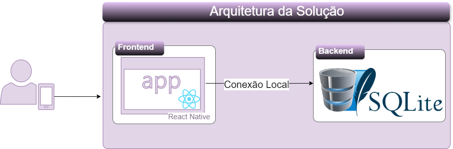
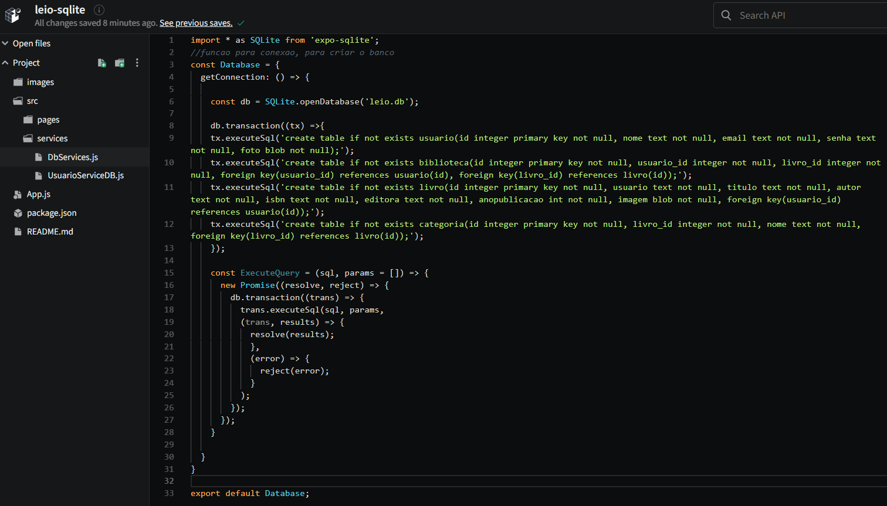
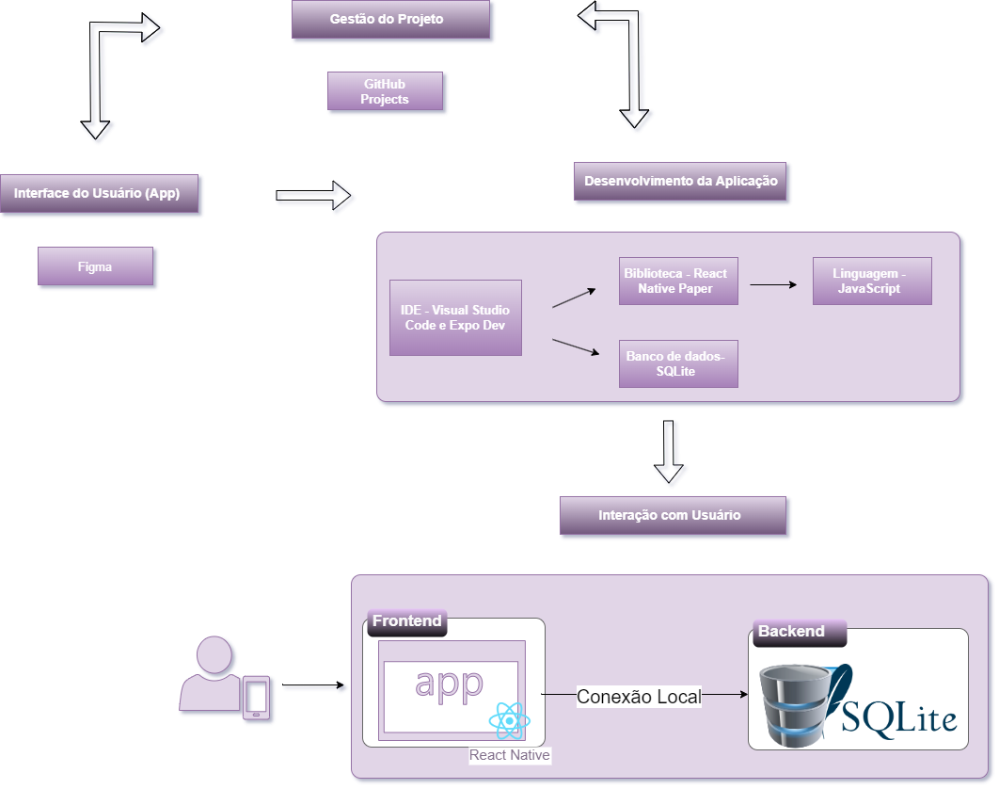

# Arquitetura da Solução

Utilizaremos o React Native, com a base de dados hospedada localmente no SQLite.

## Diagrama de Classes

O diagrama de classes ilustra graficamente como será a estrutura do software, e como cada uma das classes da sua estrutura estarão interligadas. Essas classes servem de modelo para materializar os objetos que executarão na memória.

## Modelo ER

O Modelo ER representa através de um diagrama como as entidades (coisas, objetos) se relacionam entre si na aplicação interativa.

As referências abaixo irão auxiliá-lo na geração do artefato “Modelo ER”.

## Esquema Relacional

O Esquema Relacional corresponde à representação dos dados em tabelas juntamente com as restrições de integridade e chave primária.

As referências abaixo irão auxiliá-lo na geração do artefato “Esquema Relacional”.

## Modelo Físico

A tabela abaixo representa o modelo físico do banco de dados SQLite da aplicação.

O arquivo contendo os scripts de criação das tabelas do banco de dados SQLite está localizado na pasta src/db: <a href="../src/db/DbServices.js">src/db</a>

## Tecnologias Utilizadas

| Função                                | Tecnologia                        |
| ------------------------------------- | --------------------------------- |
| Linguagem                             | JavaScript                        |
| Framework                             | ReactNative                       |
| IDE                                   | Visual Studio Code                |
| Ferramentas Wireframes                | Figma                             |
| Ferramentas de Comunicação            | Microsoft Teams, GitHub, Whatsapp |
| Ferramentas de Gestão de Projeto      | Github Projects                   |
| Ferramentas de versionamento          | Github Desktop e Git              |
| Ferramentas para criação de diagramas | Draw.io                           |
| Banco de dados                        | Firebase                          |

O usuário interage com a interface do usuário, que é construída utilizando React Native. Quando o usuário executa uma ação na interface, como clicar em um botão, uma requisição é enviada para o banco de dados. O banco de dados, processa a requisição, conforme necessário, e executa a query. Após o processamento, o banco de dados envia uma resposta de volta para o React Native frontend. O React Native frontend recebe a resposta e atualiza a interface do usuário conforme necessário para refletir o resultado da ação do usuário.

## Hospedagem

A aplicação está hospedada no Github, ela pode ser executada localmente.

## Qualidade de Software

#### Funcionalidade

- O aplicativo deve oferecer todas as funcionalidades necessárias para organizar e buscar livros, incluindo a gestão de contas de usuários, busca por livros por nome do autor, categorização de livros, visualização de informações detalhadas sobre os livros, e a capacidade de baixar e-books de domínio público.

#### Confiabilidade

- O aplicativo deve oferecer uma experiência confiável e estável para os usuários, garantindo maturidade para evitar falhas decorrentes de defeitos no software, tolerância a falhas para manter um desempenho consistente mesmo em situações adversas, capacidade de recuperação para restabelecer o funcionamento adequado após falhas e conformidade com normas de confiabilidade estabelecidas.

#### Usabilidade

- O aplicativo deve apresentar uma interface intuitiva e de fácil compreensão, permitindo que os usuários naveguem pelo aplicativo sem dificuldades e encontrem as funcionalidades desejadas rapidamente. Além disso, é essencial que o aplicativo permita que os usuários realizem suas tarefas de forma eficiente, minimizando o tempo gasto em operações como busca de livros, categorização e leitura.

#### Eficiência

- O aplicativo deve garantir um desempenho ágil, respondendo rapidamente às interações dos usuários, especialmente durante a busca de livros ou a leitura de prévias, proporcionando uma experiência fluida e sem delays. Além disso, é essencial que o aplicativo utilize os recursos do dispositivo de forma eficiente, evitando o consumo excessivo de bateria e a sobrecarga do sistema, garantindo assim uma experiência de uso otimizada e sem impactos negativos no desempenho do dispositivo.

#### Manutenibilidade

- O aplicativo deve ter facilidade de manutenção e atualização contínua do aplicativo, permitindo a adição de novas funcionalidades, correção de bugs e ajustes de desempenho conforme necessário.

#### Portabilidade

- O aplicativo deve ser compatível com uma variedade de dispositivos móveis e sistemas operacionais, proporcionando uma experiencia consistente em diferentes plataformas. Deve-se assegurar que o aplicativo funcione corretamente em diferentes ambientes, incluindo diferentes versões de sistemas operacionais móveis e tamanhos de tela, sem comprometer sua funcionalidade ou usabilidade.
