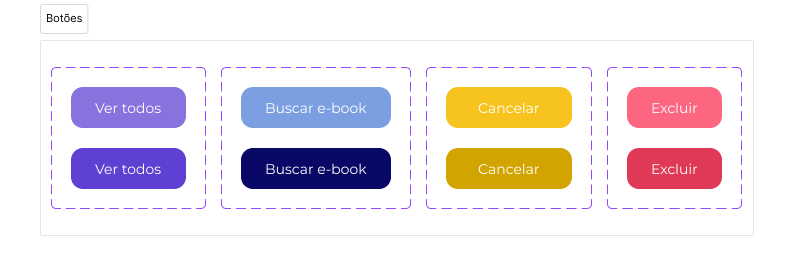

# Template Padrão da Aplicação

Pré-requisitos: <a href="02-Especificação do Projeto.md"> Especificação do Projeto</a>, <a href="03-Metodologia.md"> Metodologia</a>, <a href="04-Projeto de Interface.md"> Projeto de Interface</a>

Layout padrão da aplicação que será utilizado em todas as páginas como a definição de identidade visual, padrão para botões e iconografia.

## Identidade visual

### Logo e favicon

### Paleta de cores

### Tipografia

### Ícones

### Botões

## Estrutura

As telas do aplicativo do projeto de interface são compostas pelos seguintes layouts:

### Login

### Cadastro

### Perfil

### Página inicial

### Pesquisa

### Resultado da pesquisa

### Informações do livro

### Categorias do livro

### Biblioteca

