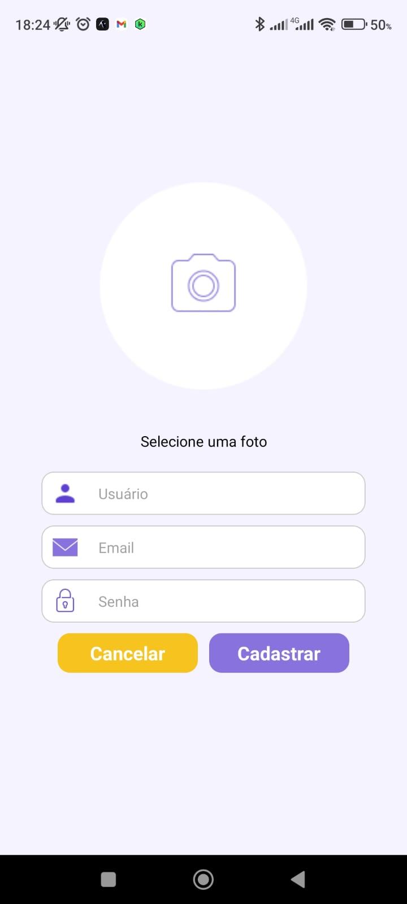

# Programação de Funcionalidades

* Nesta seção, você encontrará uma visão detalhada das telas desenvolvidas para cada funcionalidade do sistema.

## Tela de Login

<table>
  <tr>
    <td style="width: 30%;">
      
      
<em>Tela de login</em>

    </td>
    <td style="width: 70%;">
      <h3>Requisitos atendidos</h3>
      <ul>
        <li>RF01 - O sistema deve permitir que o usuário crie, edite, visualize e exclua sua conta.</li>
      </ul>
      <h3>Artefatos produzidos</h3>
      <ul>
        <li>Login.js.</li>
      </ul>
      <h3>Desenvolvedor</h3>
      <ul>
        <li>Lucas Enis.</li>
      </ul>
    </td>
  </tr>
</table>

## Tela de Cadastro

<table>
  <tr>
    <td style="width: 30%;">
      
      
<em>Tela de cadastro</em>

    </td>
    <td style="width: 70%;">
      <h3>Requisitos atendidos</h3>
      <ul>
        <li>RF01 - O sistema deve permitir que o usuário crie, edite, visualize e exclua sua conta.</li>
      </ul>
      <h3>Artefatos produzidos</h3>
      <ul>
        <li>Cadastro.js.</li>
      </ul>
      <h3>Desenvolvedor</h3>
      <ul>
        <li>Lucas Enis.</li>
      </ul>
    </td>
  </tr>
</table>
