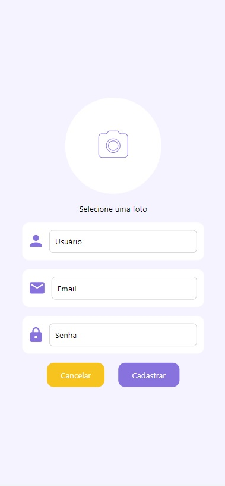

# Programação de Funcionalidades

Nesta seção, você encontrará uma visão detalhada das telas desenvolvidas para cada funcionalidade do sistema.

## Tela de Login

<table>
  <tr>
    <td style="width: 30%;">
      
    </td>
    <td style="width: 70%;">
      <h3>Requisitos atendidos</h3>
      <ul>
        <li>RF01 - O sistema deve permitir que o usuário crie, edite, visualize e exclua sua conta.</li>
      </ul>
      <h3>Artefatos produzidos</h3>
      <ul>
        <li>../Components/Login.js</li>
        <li>../assets/styles/base.js</li>
        <li>../assets/styles/login.js</li>
      </ul>
      <h3>Desenvolvedor</h3>
      <ul>
        <li>Lucas Enis</li>
      </ul>
    </td>
  </tr>
</table>

## Tela de Cadastro

<table>
  <tr>
    <td style="width: 30%;">
      
    </td>
    <td style="width: 70%;">
      <h3>Requisitos atendidos</h3>
      <ul>
        <li>RF01 - O sistema deve permitir que o usuário crie, edite, visualize e exclua sua conta.</li>
      </ul>
      <h3>Artefatos produzidos</h3>
      <ul>
        <li>../Components/Cadastro.js</li>
        <li>../assets/styles/base.js</li>
        <li>../assets/styles/cadastro.js</li>
      </ul>
      <h3>Desenvolvedor</h3>
      <ul>
        <li>Lucas Enis</li>
      </ul>
    </td>
  </tr>
</table>

## Tela inicial/Home

<table>
  <tr>
    <td style="width: 30%;">
      
    </td>
    <td style="width: 70%;">
      <h3>Requisitos atendidos</h3>
      <ul>
        <li>Todos os requisitos</li>
      </ul>
      <h3>Artefatos produzidos</h3>
      <ul>
        <li>../Components/Home.js</li>
        <li>../assets/styles/base.js</li>
        <li>../assets/styles/home.js</li>
      </ul>
      <h3>Desenvolvedora</h3>
      <ul>
        <li>Paloma Rizzon</li>
      </ul>
    </td>
  </tr>
</table>

## Tela Perfil

<table>
  <tr>
    <td style="width: 30%;">
      
    </td>
    <td style="width: 70%;">
      <h3>Requisitos atendidos</h3>
      <ul>
        <li>RF01 - O sistema deve permitir que o usuário crie, edite, visualize e exclua sua conta.</li>
      </ul>
      <h3>Artefatos produzidos</h3>
      <ul>
        <li>../Components/Perfil.js</li>
        <li>../assets/styles/base.js</li>
        <li>../assets/styles/perfil.js</li>
      </ul>
      <h3>Desenvolvedor</h3>
      <ul>
        <li>Ricardo Vieira</li>
      </ul>
    </td>
  </tr>
</table>
