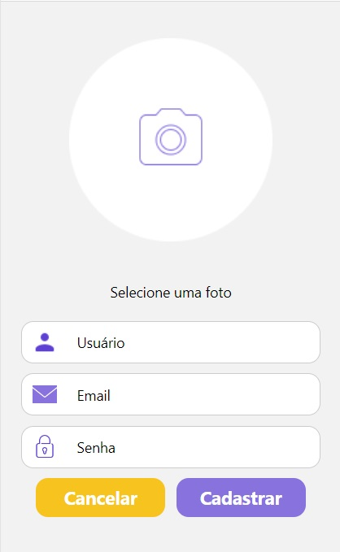

# Registro de Testes de Software

Pré-requisitos: <a href="04-Projeto de Interface.md"> Projeto de Interface</a>, <a href="08-Plano de Testes de Software.md"> Plano de Testes de Software</a>

Relatório com as evidências dos testes de software realizados no sistema pela equipe, baseado em um plano de testes pré-definido.

|    Caso de Teste    |                                   CT-01 - Criar conta                                    |
| :-----------------: | :--------------------------------------------------------------------------------------: |
|       Imagem        |                                                            |
| Requisito Associado | RF - 01 O sistema deve permitir que o usuário crie, edite, visualize e exclua sua conta. |
|      Avaliação      |                            Não foi possível criar a conta. ❌                            |

## Avaliação

Discorra sobre os resultados do teste. Ressaltando pontos fortes e fracos identificados na solução. Comente como o grupo pretende atacar esses pontos nas próximas iterações. Apresente as falhas detectadas e as melhorias geradas a partir dos resultados obtidos nos testes.

> **Links Úteis**:
>
> - [Ferramentas de Test para Java Script](https://geekflare.com/javascript-unit-testing/)
