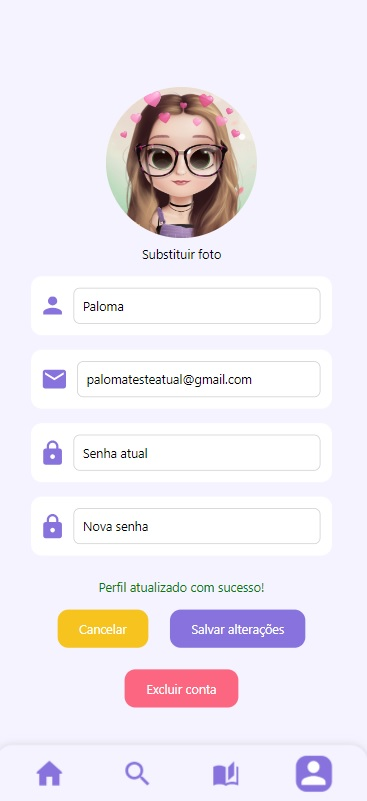
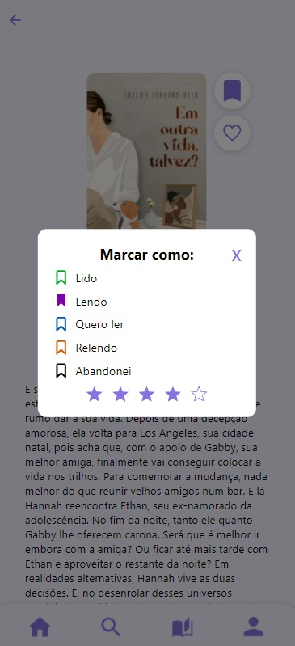
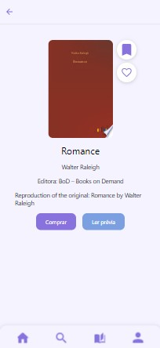

# Registro de Testes de Software

Pré-requisitos: <a href="04-Projeto de Interface.md"> Projeto de Interface</a>, <a href="08-Plano de Testes de Software.md"> Plano de Testes de Software</a>

Relatório com as evidências dos testes de software realizados no sistema pela equipe, baseado em um plano de testes pré-definido.

|    Caso de Teste    |                                   CT-01 - Criar conta                                   |
| :-----------------: | :-------------------------------------------------------------------------------------: |
|       Imagem        |                                         |
| Requisito Associado | RF01 - O sistema deve permitir que o usuário crie, edite, visualize e exclua sua conta. |
|      Avaliação      |                           A conta foi criada com sucesso. ✅                            |

|    Caso de Teste    |                                  CT-02 - Editar conta                                   |
| :-----------------: | :-------------------------------------------------------------------------------------: |
|       Imagem        |                                            |
| Requisito Associado | RF01 - O sistema deve permitir que o usuário crie, edite, visualize e exclua sua conta. |
|      Avaliação      |                              Conta editada com sucesso! ✅                              |

|    Caso de Teste    |                                CT-03 - Visualizar conta                                 |
| :-----------------: | :-------------------------------------------------------------------------------------: |
|       Imagem        |                                            |
| Requisito Associado | RF01 - O sistema deve permitir que o usuário crie, edite, visualize e exclua sua conta. |
|      Avaliação      |                            Conta visualizada com sucesso! ✅                            |

|    Caso de Teste    |                                  CT-04 - Excluir conta                                  |
| :-----------------: | :-------------------------------------------------------------------------------------: |
|       Imagem        |                                            |
| Requisito Associado | RF01 - O sistema deve permitir que o usuário crie, edite, visualize e exclua sua conta. |
|      Avaliação      |                             Conta excluída com sucesso! ✅                              |

|    Caso de Teste    |                                                CT-05 - Buscar livros                                                |
| :-----------------: | :-----------------------------------------------------------------------------------------------------------------: |
|       Imagem        |                                                                     |
| Requisito Associado | RF02 - O sistema deve permitir que o usuário possa buscar pelos seus livros pelo nome do livro, categoria ou autor. |
|      Avaliação      |                                         Pesquisa realizada com sucesso. ✅                                          |

|    Caso de Teste    |                                                                     CT-06 - Categorizar livros                                                                      |
| :-----------------: | :-----------------------------------------------------------------------------------------------------------------------------------------------------------------: |
|       Imagem        |                                                                                                                        |
| Requisito Associado | RF03 - O sistema deve permitir que o usuário possa marcar seus livros de acordo com categorias pré estabelecidas, sendo elas: lido, quero ler, relendo e abandonei. |
|      Avaliação      |                                                                    Livro marcado com sucesso. ✅                                                                    |

|    Caso de Teste    |                                                          CT-07 - Ler descrição dos livros                                                           |
| :-----------------: | :-------------------------------------------------------------------------------------------------------------------------------------------------: |
|       Imagem        |                                                                                                              |
| Requisito Associado | RF04 - O sistema deve permitir que o usuário possa ler a descrição do livro buscado, contendo título, autor, imagem, editora, sinopse e avaliações. |
|      Avaliação      |                                                    Descrição do livro disponível com sucesso. ✅                                                    |

|    Caso de Teste    |                         CT-08 - Link de compra na Play Store                          |
| :-----------------: | :-----------------------------------------------------------------------------------: |
|       Imagem        |                                      |
| Requisito Associado | RF05 - O sistema deve permitir que o usuário acesse o link para compra na Play Store. |
|      Avaliação      |                  Link redirecionado para a Play Store com sucesso ✅                  |

|    Caso de Teste    |                            CT-09 - Ler prévia de livro                             |
| :-----------------: | :--------------------------------------------------------------------------------: |
|       Imagem        |                                   |
| Requisito Associado | RF06 - O sistema deve permitir que o usuário possa ver uma prévia do livro na API. |
|      Avaliação      |              Link redirecionado com sucesso para a prévia na API. ✅               |

|    Caso de Teste    |                                    CT-10 - Avaliar livros                                     |
| :-----------------: | :-------------------------------------------------------------------------------------------: |
|       Imagem        |                                                  |
| Requisito Associado | RF07 - O sistema deve permitir que o usuário possa avaliar o livro lido entre 1 e 5 estrelas. |
|      Avaliação      |                              Avaliação efetuada com sucesso. ✅                               |

|    Caso de Teste    |                                      CT-11 - Buscar PDF's gratuitos na Biblioteca                                       |
| :-----------------: | :---------------------------------------------------------------------------------------------------------------------: |
|       Imagem        |  |
| Requisito Associado |             RF08 - O sistema deve permitir ao usuário buscar livros listados como gratuitos na biblioteca.              |
|      Avaliação      |                    Os livros exibidos no resultado de pesquisa possuem PDF para download na API. ✅                     |

|    Caso de Teste    |                                CT-12 - Visualizar livros categorizados                                 |
| :-----------------: | :----------------------------------------------------------------------------------------------------: |
|       Imagem        |  |
| Requisito Associado |     RF08 - O sistema deve permitir ao usuário buscar livros listados como gratuitos na biblioteca.     |
|      Avaliação      |                     Os livros exibidos foram categorizados pelo usuário logado. ✅                     |

## Avaliação

Todos os testes foram realizados com sucesso!
