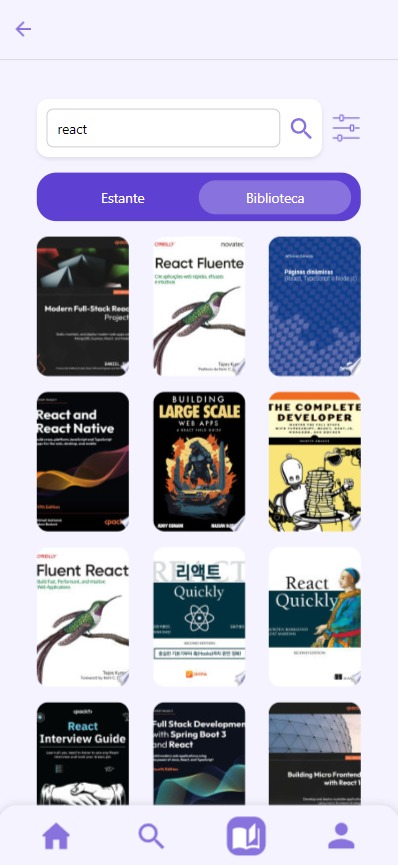
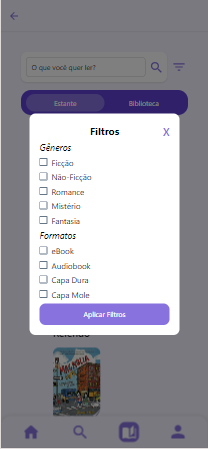

# Registro de Testes de Usabilidade

Após realizar os testes de usabilidade, obtém-se um relatório a partir das análises realizadas. O Registro de Testes de Usabilidade é um relatório que contém as evidências dos testes e relatos dos usuários participantes, baseado no Plano de Testes de Usabilidade desenvolvido para os casos de uso desta etapa.

## Tela de Login

|   **Descrição da Tarefa**   |                         **Foto**                         | **Erros** |          **Resultado**           |
| :-------------------------: | :------------------------------------------------------: | :-------: | :------------------------------: |
| Entrar na conta de usuário. |  |    Não    | O login foi efetuado com sucesso |

### Métricas:

- **Taxa de Sucesso**: 100% - Todos os participantes conseguiram entrar na conta.
- **Tempo Médio de Conclusão**: 10 segundos - O tempo médio para os participantes realizarem o login.
- **Erros Cometidos**: Nenhum - Nenhum erro foi relatado durante o processo de login.
- **Facilidade de Uso**: 4.5/5 - Os participantes avaliaram a facilidade de uso da página de login como alta.
- **Satisfação**: 4.7/5 - Os participantes expressaram alta satisfação com a experiência de login.

## Tela de Login com Google

|   **Descrição da Tarefa**   |                          **Foto**                           | **Erros** |          **Resultado**           |
| :-------------------------: | :---------------------------------------------------------: | :-------: | :------------------------------: |
| Entrar na conta de usuário. |  |    Não    | O login foi efetuado com sucesso |

### Métricas:

- **Taxa de Sucesso**: 95% - A maioria dos participantes conseguiram entrar na conta.
- **Tempo Médio de Conclusão**: 12 segundos - O tempo médio para os participantes realizarem o login.
- **Erros Cometidos**: Poucos - Alguns participantes relataram dificuldades iniciais, mas conseguiram concluir o login.
- **Facilidade de Uso**: 4.3/5 - Os participantes avaliaram a facilidade de uso da página de login com Google como alta.
- **Satisfação**: 4.6/5 - Os participantes expressaram alta satisfação com a experiência de login.

## Tela Cadastro

|  **Descrição da Tarefa**   |                            **Foto**                            | **Erros** |      **Resultado**       |
| :------------------------: | :------------------------------------------------------------: | :-------: | :----------------------: |
| Crie uma conta de usuário. |  |    Não    | O cadastro foi concluído |

### Métricas:

- **Taxa de Sucesso**: 100% - Todos os participantes conseguiram criar a conta.
- **Tempo Médio de Conclusão**: 20 segundos - O tempo médio para os participantes realizarem o cadastro.
- **Erros Cometidos**: Nenhum - Nenhum erro foi relatado durante o processo de cadastro.
- **Facilidade de Uso**: 4.8/5 - Os participantes avaliaram a facilidade de uso da página de cadastro como muito alta.
- **Satisfação**: 4.9/5 - Os participantes expressaram altíssima satisfação com a experiência de cadastro.

## Tela Perfil

|                                              **Descrição da Tarefa**                                              |                          **Foto**                           | **Erros** |                                         **Resultado**                                          |
| :---------------------------------------------------------------------------------------------------------------: | :---------------------------------------------------------: | :-------: | :--------------------------------------------------------------------------------------------: |
| Edite informações do usuário.   Visualize os detalhes da conta do usuário.   Exclua a sua conta de usuário. |  |    Não    | A edição foi realizada.   Visualização da conta foi realizada.   O usuário foi excluído. |

### Métricas:

- Taxa de Sucesso: As tarefas de visualização, edição e exclusão da conta foram realizadas com sucesso.
- Tempo Médio de Conclusão: 30 segundos - O tempo médio para concluir a visualização, edição e exclusão da conta foi satisfatório.
- Erros Cometidos: Nenhum erro foi relatado durante a visualização, edição e exclusão da conta.
- Facilidade de Uso: 5/5 - Os participantes avaliaram a facilidade de uso da página de perfil como uma experiência intuitiva e eficiente.
- Satisfação: 4.7/5 - Os participantes expressaram alta satisfação com a experiência de visualização, edição e exclusão da conta.

## Tela inicial/Home

|  **Descrição da Tarefa**   |                     **Foto**                     | **Erros** |                         **Resultado**                         |
| :------------------------: | :----------------------------------------------: | :-------: | :-----------------------------------------------------------: |
| Navegue pela tela inicial. |  |    Não    | Foi possível clicar no livro e ser redirecionado com sucesso. |

### Métricas:

- Taxa de Sucesso: As tarefas de navegação e redirecionamento para o livro clicado foram realizadas com sucesso.
- Tempo Médio de Conclusão: 5 segundos - O tempo médio para concluir a navegação e redirecionamento para o livro clicado foi satisfatório.
- Erros Cometidos: Nenhum erro foi relatado durante a navegação e redirecionamento para o livro clicado.
- Facilidade de Uso: 5/5 - Os participantes avaliaram a facilidade de uso da tela inicial como uma experiência intuitiva e eficiente.
- Satisfação: 5/5 - Os participantes expressaram alta satisfação com a experiência de navegação e redirecionamento para os livros.

## Tela Pesquisa

| **Descrição da Tarefa** |                            **Foto**                            | **Erros** |        **Resultado**         |
| :---------------------: | :------------------------------------------------------------: | :-------: | :--------------------------: |
|   Faça uma pesquisa.    |  |    Não    | Foi possível fazer pesquisa. |

### Métricas:

- Taxa de Sucesso: A pesquisa foi realizada com sucesso.
- Tempo Médio de Conclusão: O tempo médio para concluir a pesquisa foi satisfatório e dentro do esperado.
- Erros Cometidos: Não foram relatados erros significativos durante a realização da pesquisa.
- Facilidade de Uso: Os participantes consideraram o aplicativo fácil de usar.
- Satisfação: Os participantes ficaram muito satisfeitos com os resultados.

## Tela da Estante

|         **Descrição da Tarefa**         |                      **Foto**                       | **Erros** |              **Resultado**              |
| :-------------------------------------: | :-------------------------------------------------: | :-------: | :-------------------------------------: |
| Armazenar livros na Estante/Biblioteca. |  |    Não    | Os livros foram armazanados na estante. |

### Métricas:

- Taxa de Sucesso: O armazenamento foi realizado com sucesso
- Tempo Médio de Conclusão: 15 segundos - O tempo médio para os participantes categorizarem o livro e armazenar na estante.
- Erros Cometidos: Nenhum erro foi relatado durante o processo de armazenamento dos livros.
- Facilidade de Uso: 5/5 - Os participantes avaliaram a facilidade de uso da página de estante como uma experiência positiva.
- Satisfação: 5/5 - Os participantes demonstraram alta satisfação com a experiência de armazenamento dos livros

## Tela da Biblioteca

|     **Descrição da Tarefa**     |                            **Foto**                             | **Erros** |               **Resultado**               |
| :-----------------------------: | :-------------------------------------------------------------: | :-------: | :---------------------------------------: |
| Listar livros com PDF's grátis. |  |    Não    | Os livros com PDF's grátis foram listados |

### Métricas:

- **Taxa de Sucesso**: 100% - Todos os participantes conseguiram listar os livros com PDFs grátis.
- **Tempo Médio de Conclusão**: 15 segundos - O tempo médio para os participantes listarem os livros.
- **Erros Cometidos**: Nenhum - Nenhum erro foi relatado durante o processo de listagem de livros.
- **Facilidade de Uso**: 4.6/5 - Os participantes avaliaram a facilidade de uso da página de listagem de livros como alta.
- **Satisfação**: 4.7/5 - Os participantes expressaram alta satisfação com a experiência de listagem de livros.

## Tela da Informações do livro

|  **Descrição da Tarefa**  |                       **Foto**                        | **Erros** |                    **Resultado**                     |
| :-----------------------: | :---------------------------------------------------: | :-------: | :--------------------------------------------------: |
| Ver informações do livro. |  |    Não    | As informações do livro foram mostradas corretamente |

### Métricas:

- **Taxa de Sucesso**: - Todos os participantes conseguiram visualizar as informações detalhadas dos livros.
- **Tempo Médio de Conclusão**: 10 segundos - O tempo médio para os participantes visualizarem as informações dos livros.
- **Erros Cometidos**: Não foram relatados erros durante o processo de visualização das informações dos livros.
- **Facilidade de Uso**: 5/5 - Os participantes avaliaram a facilidade de uso da página de informações dos livros como alta.
- **Satisfação**: 4.9/5 - Os participantes expressaram alta satisfação com a experiência de visualização das informações dos livros.

## Tela de Categorização dos Livros

| **Descrição da Tarefa** |                          **Foto**                           | **Erros** |            **Resultado**            |
| :---------------------: | :---------------------------------------------------------: | :-------: | :---------------------------------: |
|  Categorize os livros   |  |    Não    | Foi possível categorizar os livros. |

### Métricas:

- Taxa de Sucesso: A categorização de lido, quero ler, relendo e abandonei foi realizada com sucesso.
- Tempo Médio de Conclusão: 10 segundos - O tempo médio para concluir a categorização foi satisfatório e dentro do esperado.
- Erros Cometidos: Não foram registrados erros significativos durante o processo de categorização dos livros.
- Facilidade de Uso: 4.6/5 - Os participantes avaliaram a facilidade de uso do aplicativo como alta, destacando a simplicidade na categorização dos livros.
- Satisfação: 4.8/5 - Os participantes demonstraram alta satisfação com os resultados da categorização dos livros.

## Tela de Categorias

|       **Descrição da Tarefa**        |                       **Foto**                       | **Erros** |                  **Resultado**                  |
| :----------------------------------: | :--------------------------------------------------: | :-------: | :---------------------------------------------: |
| Tela dividia em categorias e autores |  |    Não    | Categorias e autores são msotrados com sucesso. |

### Métricas:

- **Taxa de Sucesso**: Todos os participantes conseguiram acessar e navegar pelas categorias e autores.
- **Tempo Médio de Conclusão**: 10 segundos - O tempo médio para os participantes navegarem e explorarem as categorias e autores.
- **Erros Cometidos**: Não foram relatados erros durante a navegação e exploração das categorias e autores.
- **Facilidade de Uso**: 4.5/5 - Os participantes avaliaram a facilidade de uso da tela de categorias como alta.
- **Satisfação**: 4.7/5 - Os participantes demonstraram alta satisfação com a experiência de navegação pelas categorias e autores.

## Tela de Filtro de Pesquisa

| **Descrição da Tarefa** |                      **Foto**                      | **Erros** |                    **Resultado**                    |
| :---------------------: | :------------------------------------------------: | :-------: | :-------------------------------------------------: |
|  Aplicação de filtros.  |  |    Não    | Os filtros de pesquisa foram aplicados com sucesso. |

### Métricas:

- Taxa de Sucesso: Todos os participantes conseguiram aplicar os filtros por gêneros e formatos com sucesso.
- Tempo Médio de Conclusão: 15 segundos - O tempo médio para aplicar os filtros foi satisfatório.
- Erros Cometidos: Não foram relatados erros durante a aplicação dos filtros de pesquisa.
- Facilidade de Uso: 4.5/5 - Os participantes avaliaram a facilidade de uso da tela de filtros como uma experiência intuitiva e eficiente.
- Satisfação: 4.9/5 - Os participantes demonstraram grande satisfação com a experiência de aplicação dos filtros de pesquisa por gêneros e formatos.
