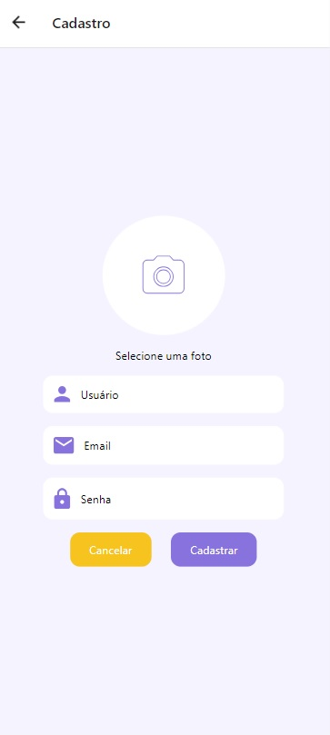
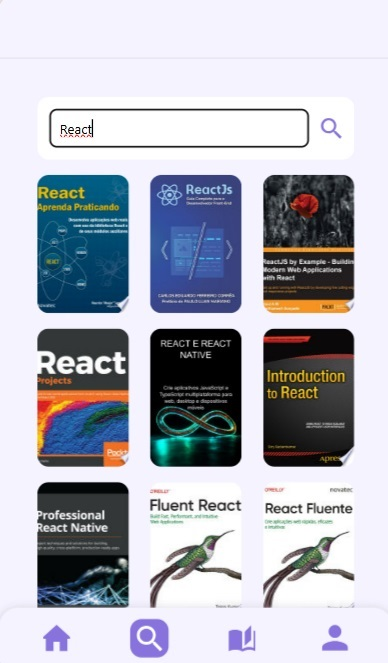

# Registro de Testes de Usabilidade

Após realizar os testes de usabilidade, obtém-se um relatório a partir das análises realizadas. O Registro de Testes de Usabilidade é um relatório que contém as evidências dos testes e relatos dos usuários participantes, baseado no Plano de Testes de Usabilidade desenvolvido para os casos de uso desta etapa.

## Tela de Login

|   **Descrição da Tarefa**   |                     **Foto**                      | **Erros** |      **Resultado**       |
| :-------------------------: | :-----------------------------------------------: | :-------: | :----------------------: |
| Entrar na conta de usuário. |  |    Sim    | O login não foi efetuado |

### Métricas:

- Taxa de Sucesso: Não aplicável devido à impossibilidade de entrar na conta.
- Tempo Médio de Conclusão: Não aplicável devido à impossibilidade de entrar na conta.
- Erros Cometidos: Os participantes relataram tentativas malsucedidas de conclusão do cadastro devido a falhas no funcionamento da página de login.
- Facilidade de Uso: Não aplicável devido à impossibilidade de entrar na conta.
- Satisfação: Não aplicável devido à impossibilidade de entrar na conta.

## Tela Cadastro

|  **Descrição da Tarefa**   |                       **Foto**                       | **Erros** |        **Resultado**         |
| :------------------------: | :--------------------------------------------------: | :-------: | :--------------------------: |
| Crie uma conta de usuário. |  |    Sim    | O cadastro não foi concluído |

### Métricas:

- Taxa de Sucesso: Não aplicável devido à impossibilidade de criar a conta.
- Tempo Médio de Conclusão: Não aplicável devido à impossibilidade de criar a conta.
- Erros Cometidos: Os participantes relataram tentativas malsucedidas de conclusão do cadastro devido a falhas no funcionamento da página de cadastro.
- Facilidade de Uso: Não aplicável devido à impossibilidade de criar a conta.
- Satisfação: Não aplicável devido à impossibilidade de criar a conta.

## Tela Perfil

|                                              **Descrição da Tarefa**                                              |                      **Foto**                      | **Erros** |                                             **Resultado**                                              |
| :---------------------------------------------------------------------------------------------------------------: | :------------------------------------------------: | :-------: | :----------------------------------------------------------------------------------------------------: |
| Edite informações do usuário.   Visualize os detalhes da conta do usuário.   Exclua a sua conta de usuário. |  |    Sim    | A edição não foi realizada.   Visualização da conta não realizada.   O usuário não foi excluído. |

### Métricas:

- Taxa de Sucesso: Não aplicável devido à impossibilidade de visualizar, editar e excluir a conta.
- Tempo Médio de Conclusão: Não aplicável devido à impossibilidade de visualizar, editar e excluir a conta.
- Erros Cometidos: Os participantes relataram tentativas malsucedidas de visualização, edição e exclusão da conta devido a falhas no funcionamento da página de perfil.
- Facilidade de Uso: Não aplicável devido à impossibilidade de visualizar, editar e excluir a conta.
- Satisfação: Não aplicável devido à impossibilidade de visualizar, editar e excluir a conta.

## Tela inicial/Home

|  **Descrição da Tarefa**   |                     **Foto**                     | **Erros** |           **Resultado**           |
| :------------------------: | :----------------------------------------------: | :-------: | :-------------------------------: |
| Navegue pela tela inicial. |  |    Sim    | Não foi possível clicar no livro. |

### Métricas:

- Taxa de Sucesso: Não aplicável devido à impossibilidade de ser redirecinado para o livro clicado.
- Tempo Médio de Conclusão: Não aplicável devido à impossibilidade de criar a conta.
- Erros Cometidos: Os participantes relataram tentativas malsucedidas em selecionar o livro escolhido devido a falhas no funcionamento do aplicativo.
- Facilidade de Uso: Não aplicável devido à impossibilidade de ser redirecinado para o livro clicado.
- Satisfação: Não aplicável devido à impossibilidade de ser redirecinado para o livro clicado.

## Tela Pesquisa

| **Descrição da Tarefa** |                       **Foto**                       | **Erros** |          **Resultado**           |
| :---------------------: | :--------------------------------------------------: | :-------: | :------------------------------: |
|   Faça uma pesquisa.    |  |    Sim    | Não foi possível fazer pesquisa. |

| **Descrição da Tarefa** |                       **Foto**                       | **Erros** |          **Resultado**           |
| :---------------------: | :--------------------------------------------------: | :-------: | :------------------------------: |
|   Faça uma pesquisa.    |  |    Não    | Foi possível fazer pesquisa. |

### Métricas:

- Taxa de Sucesso: Não aplicável devido à impossibilidade de realizar a pesquisa.
- Tempo Médio de Conclusão: Não aplicável devido à impossibilidade realizar a pesquisa.
- Erros Cometidos: Os participantes relataram tentativas malsucedidas em fazer uma pesquisa devido a falhas no funcionamento do aplicativo.
- Facilidade de Uso: Não aplicável devido à impossibilidade de não ser possível redirecionar para o resultado da pesquisa.
- Satisfação: Não aplicável devido à impossibilidade de avaliar a satisfação dos participantes.

## Tela da Estante/Biblioteca

|         **Descrição da Tarefa**         |                        **Foto**                        | **Erros** |            **Resultado**            |
| :-------------------------------------: | :----------------------------------------------------: | :-------: | :---------------------------------: |
| Armazenar livros na Estante/Biblioteca. |  |    Sim    | Não foi possível realizar a tarefa. |

### Métricas:

- Taxa de Sucesso: Não aplicável devido à inexistência de livros reais.
- Tempo Médio de Conclusão: Não aplicável devido à inexistência de livros reais.
- Erros Cometidos: Os participantes relataram tentativas malsucedidas em fazer armazenar os livros devido a falhas no funcionamento do aplicativo.
- Facilidade de Uso: Não aplicável devido à impossibilidade de não ser possível escolher um livro para ser armazenado na Estante/Biblioteca.
- Satisfação: Não aplicável devido à impossibilidade de avaliar a satisfação dos participantes.
